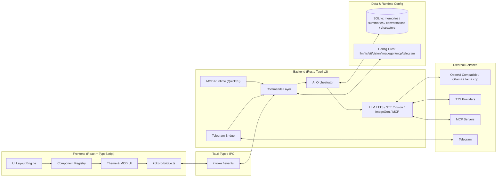

<div align="center">
  <a href="README.md">简体中文</a> | <a href="README_ZH-TW.md">繁體中文</a> | <a href="README_EN.md">English</a> | <a href="README_JA.md">日本語</a> | <a href="README_KO.md">한국어</a> | <a href="README_RU.md">Русский</a>
</div>

<br/>

<p align="center">
  
</p>

<h1 align="center">Kokoro Engine</h1>
<p align="center"><strong>Open-source immersive character engine for desktop AI companions.</strong></p>
<p align="center">为每一位想拥有专属AI聊天伴侣的用户打造的跨平台虚拟角色交互引擎。</p>

<p align="center">
  <a href="https://t.me/+U39dgiUspCo2NDNh"></a>
  
  
  
  
</p>
<p align="center">
  <a href="#-快速开始">快速开始</a> ·
  <a href="https://github.com/chyinan/Kokoro-Engine/releases">下载安装</a> ·
  <a href="#-技术架构">架构</a> ·
  <a href="#-参与贡献">贡献</a>
</p>


---

##  Kokoro Engine 的独到之处

Kokoro Engine 不是“聊天壳子 + 桌宠皮肤”。它是一个完整的桌面角色运行时：

- **All-in-one**：Live2D、LLM、TTS、STT等技术集成在一个运行时闭环。
- **Built for extensibility**：高自由度 MOD 系统 + MCP 协议，天然面向扩展。
- **Local-first**：本地存储记忆、离线优先、数据链路可控。

## 一览

| 维度 | 内容 |
|---|---|
| 面向用户 | 虚拟角色创作者、开发者、普通用户 |
| 交互能力 | 文本、语音、图片、视觉输入、多模态对话 |
| 扩展方式 | MOD（HTML/CSS/JS + QuickJS）、MCP Servers |
| 技术栈 | React + TypeScript + Rust + Tauri v2 + SQLite |
| 语言支持 | 简体中文 / 繁體中文 / English / 日本語 / 한국어 / Русский |

## 📸 UI截图

<div align="center">
  
  <p><em>主界面</em></p>
  
  <p><em>设置界面</em></p>
</div>

## 🚀 快速开始

### 路径一：下载发布版（推荐）

前往 [Releases 页面](https://github.com/chyinan/Kokoro-Engine/releases) 下载对应平台安装包后直接运行。

### 路径二：从源码构建

#### 环境要求

- [Node.js](https://nodejs.org/)（v18+）
- [Rust](https://www.rust-lang.org/tools/install)（stable）

#### 安装与运行

```bash
git clone https://github.com/chyinan/kokoro-engine.git
cd kokoro-engine
npm install
npm run tauri dev
```

#### 构建发行版

```bash
npm run tauri build
```

### 路径三：Nix / Flakes（仅 Linux）

```bash
nix develop
npm install
npm run tauri dev
```

更多 Nix 用法见 [docs/nix.md](docs/nix.md)。

## ✨ 核心能力

### 交互引擎

- Live2D 渲染、视线追踪、动作触发、桌面浮窗
- 模型热切换、帧率自定义

### 多维架构

- 支持 Ollama 、llama.cpp 与 OpenAI 、Anthropic 兼容协议API接口
- 支持多模态输入、上下文回溯、长期记忆与情感状态

### 音频交互

- TTS（文本转语音）：GPT-SoVITS、VITS、OmniVoice、OpenAI、Azure、ElevenLabs、Edge TTS、Browser TTS
- STT（语音转文本）：Whisper / faster-whisper / whisper.cpp / SenseVoice
- 支持 VAD 自动停录与唤醒词链路

### 可拓展性

- MOD 框架：HTML/CSS/JS 超高自由度 UI 主题替换 + QuickJS 脚本沙箱
- MCP 支持：连接 MCP Server 并调用外部工具
- 内置官方示范 MOD：`mods/genshin-theme`

### 远程连接

- 内置 Telegram、Discord、LINE、Webhook 四种 Bot 服务
- 文字、语音、图片消息完整桥接到 AI 管线流

## 🏗️ 技术架构



- 前端：声明式布局、组件注册、主题系统、MOD UI 注入
- 后端：命令模块 + 多模态编排（LLM/TTS/STT/Vision/ImageGen/MCP）
- 数据层：以 SQLite 为底座构建本地优先记忆层，统一持久化角色、会话、摘要与长期记忆，并通过 `embedding + FTS5 BM25 + RRF` 混合检索提供稳定长期上下文；梦境整理结合规则筛选、LLM 复核与定时/手动任务，对重复、冲突和可合并记忆进行持续治理。

详细设计见 [docs/architecture.md](docs/architecture.md)。

## 🗺️ 路线图

### 现在

- 跨平台稳定性与兼容性验证（Windows / Linux / macOS）
- 在线服务链路深度测试
- 记忆系统与多模态体验持续优化

### 下一步

- 角色市场 / 工坊
- 移动端支持探索（iOS / Android）
- 开发者扩展生态增强

## 🤝 参与贡献

欢迎通过以下方式参与：

1. **Pull Requests**：修复问题或新增功能。
2. **Issues**：提交问题与改进建议。
3. **Discussions**：分享想法与实践。
4. **Design contributions**：欢迎提供 Logo / 视觉资产。

## 💬 社区

👉 [**Kokoro Engine 官方讨论群（Telegram）**](https://t.me/+U39dgiUspCo2NDNh)

## ❤️ 赞助

👉 [**查看赞助方式 / Sponsor**](SPONSOR.md)


## 🎉 特别鸣谢

感谢所有为 Kokoro Engine 做出贡献的贡献者。

<table align="center">
  <tr>
    <td align="center">
      <a href="https://github.com/aegbirou">
        
      </a>
      <br />
      <sub>@aegbirou</sub>
    </td>
    <td align="center">
      <a href="https://github.com/Initsnow">
        
      </a>
      <br />
      <sub>@Initsnow</sub>
    </td>
  </tr>
</table>


## 📄 许可协议

本项目核心代码遵循 **MIT License**。

### ⚠️ Live2D Cubism SDK 声明

本项目使用 **Live2D Cubism SDK**，相关部分归 Live2D Inc. 所有。使用本项目（包括编译、分发、修改）时，请遵守 Live2D 许可协议：

- [Live2D Proprietary Software License Agreement](https://www.live2d.com/eula/live2d-proprietary-software-license-agreement_en.html)
- [Live2D Open Software License Agreement](https://www.live2d.com/eula/live2d-open-software-license-agreement_en.html)

> 若您属于年营业额超过 1000 万日元的中大型企业，可能需要与 Live2D Inc. 签署单独商业授权协议。

### ⚠️ 内置 Live2D 样本模型声明

本项目内置的默认模型 **Hiyori Momose - PRO** 来自 Live2D 官方样本数据。该样本模型的使用受 Live2D Free Material License Agreement 与样本数据条款约束：

- [Live2D Sample Data](https://www.live2d.com/en/learn/sample/)
- [Live2D Sample Model Terms](https://www.live2d.com/en/learn/sample/model-terms/)

版权信息：Illustration: Kani Biimu / Modeling: Live2D。请勿修改 Hiyori Momose 的角色设计。非一般用户或小规模企业用户使用时，请自行确认是否需要 Live2D Inc. 的额外许可。

---

**Kokoro Engine** is an open-source project.
Live2D is a registered trademark of Live2D Inc.
