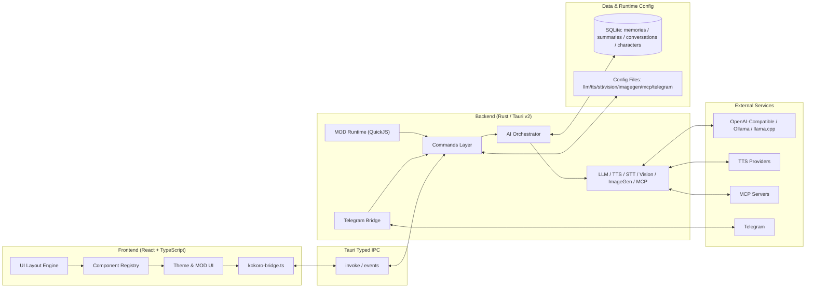

<div align="center">
  <a href="README.md">简体中文</a> | <a href="README_ZH-TW.md">繁體中文</a> | <a href="README_EN.md">English</a> | <a href="README_JA.md">日本語</a> | <a href="README_KO.md">한국어</a> | <a href="README_RU.md">Русский</a>
</div>

<br/>

<p align="center">
  
</p>

<h1 align="center">Kokoro Engine</h1>
<p align="center"><strong>Open-source immersive character engine for desktop AI companions.</strong></p>
<p align="center">A cross-platform virtual character interaction engine for users who want a personalized AI companion.</p>

<p align="center">
  <a href="https://t.me/+U39dgiUspCo2NDNh"></a>
  
  
  
  
</p>

<p align="center">
  <a href="#-quick-start">Quick start</a> ·
  <a href="https://github.com/chyinan/Kokoro-Engine/releases">Download release</a> ·
  <a href="#-technical-architecture">Architecture</a> ·
  <a href="#-contributing">Contributing</a>
</p>

---

## What makes Kokoro Engine stand out

Kokoro Engine is not just a chat shell with a desktop pet skin. It is a complete desktop character runtime:

- **All-in-one**: Live2D, LLM, TTS, and STT are integrated into one runtime loop.
- **Built for extensibility**: a high-freedom MOD system and MCP protocol.
- **Local-first**: local memory storage, offline-first behavior, and a controllable data path.

## Overview

| Dimension | Details |
|---|---|
| Target users | virtual character creators, developers, and general users |
| Interaction modes | text, voice, image, vision input, multimodal dialogue |
| Extension model | MOD (HTML/CSS/JS + QuickJS), MCP servers |
| Tech stack | React + TypeScript + Rust + Tauri v2 + SQLite |
| Language support | 简体中文 / 繁體中文 / English / 日本語 / 한국어 / Русский |

## 📸 UI screenshots

<div align="center">
  
  <p><em>Main screen</em></p>
  
  <p><em>Settings screen</em></p>
</div>

## 🚀 Quick start

### Path 1: Download release (recommended)

Go to the [Releases page](https://github.com/chyinan/Kokoro-Engine/releases), download the installer for your platform, and run it.

### Path 2: Build from source

#### Requirements

- [Node.js](https://nodejs.org/) (v18+)
- [Rust](https://www.rust-lang.org/tools/install) (stable)

#### Install and run

```bash
git clone https://github.com/chyinan/kokoro-engine.git
cd kokoro-engine
npm install
npm run tauri dev
```

#### Build release

```bash
npm run tauri build
```

### Path 3: Nix / Flakes (Linux only)

```bash
nix develop
npm install
npm run tauri dev
```

For more Nix usage, see [docs/nix.md](docs/nix.md).

## ✨ Core capabilities

### Character runtime

- Live2D rendering, eye tracking, motion triggers, desktop floating mode.
- Model hot-switching and interaction state recovery.

### AI brain

- Supports Ollama, llama.cpp, and protocol API interfaces compatible with OpenAI and Anthropic.
- Supports multimodal input, context recall, long-term memory, and emotional state continuity.

### Voice stack

- TTS (text-to-speech): GPT-SoVITS, VITS, OpenAI, Azure, ElevenLabs, Edge TTS, Browser TTS.
- STT (speech-to-text): Whisper / faster-whisper / whisper.cpp / SenseVoice.
- Supports VAD auto-stop and wake-word flow.

### Extensibility

- MOD framework: HTML/CSS/JS UI replacement + QuickJS script sandbox.
- MCP support: connect MCP servers and call external tools.
- Built-in official demo MOD: `mods/genshin-theme`.

### Remote interaction

- Built-in Telegram Bot service.
- Bridges text, voice, and image messages to the full AI pipeline.

## 🏗️ Technical architecture



- Frontend: declarative layout, component registry, theme system, MOD UI injection.
- Backend: command modules + AI orchestration (LLM/TTS/STT/Vision/ImageGen/MCP).
- Data layer: a local-first memory layer built on SQLite, persistently storing characters, conversations, summaries, and long-term memory, with `embedding + FTS5 BM25 + RRF` hybrid retrieval for stable long-term dialogue context; dream consolidation combines rule-based screening, LLM review, and scheduled/manual jobs to continuously govern duplicate, conflicting, and mergeable memories.

See [docs/architecture.md](docs/architecture.md) for details.

## 🗺️ Roadmap

### Current

- Cross-platform stability and compatibility validation (Windows / Linux / macOS).
- Deep testing of online service pipelines.
- Ongoing optimization of memory and multimodal experience.

### Next

- Character marketplace / workshop.
- Mobile support exploration (iOS / Android).
- Stronger developer extension ecosystem.

## 🤝 Contributing

You can contribute in these ways:

1. **Pull requests**: fix issues or add features.
2. **Issues**: report bugs and propose improvements.
3. **Discussions**: share ideas and practical experience.
4. **Design contributions**: logo and visual assets are welcome.

## 💬 Community

👉 [**Kokoro Engine official Telegram group**](https://t.me/+U39dgiUspCo2NDNh)

## ❤️ Sponsor

👉 [**Sponsorship options / Sponsor**](SPONSOR.md)

## 🎉 Special Thanks

Special thanks to all contributors for their contributions to Kokoro Engine.

<table align="center">
  <tr>
    <td align="center">
      <a href="https://github.com/aegbirou">
        
      </a>
      <br />
      <sub>@aegbirou</sub>
    </td>
    <td align="center">
      <a href="https://github.com/Initsnow">
        
      </a>
      <br />
      <sub>@Initsnow</sub>
    </td>
  </tr>
</table>


## 📄 License

Core project code is licensed under **MIT License**.

### ⚠️ Live2D Cubism SDK notice

This project uses **Live2D Cubism SDK**, and related parts are owned by Live2D Inc. If you compile, distribute, or modify this project, you must comply with Live2D license terms:

- [Live2D Proprietary Software License Agreement](https://www.live2d.com/eula/live2d-proprietary-software-license-agreement_en.html)
- [Live2D Open Software License Agreement](https://www.live2d.com/eula/live2d-open-software-license-agreement_en.html)

> Organizations with annual revenue above JPY 10 million may need a separate commercial license agreement with Live2D Inc.

### ⚠️ Bundled Live2D sample model notice

The bundled default model **Hiyori Momose - PRO** is official Live2D sample data. Use of this sample model is governed by the Live2D Free Material License Agreement and sample data terms:

- [Live2D Sample Data](https://www.live2d.com/en/learn/sample/)
- [Live2D Sample Model Terms](https://www.live2d.com/en/learn/sample/model-terms/)

Credits: Illustration: Kani Biimu / Modeling: Live2D. Do not modify Hiyori Momose's character design. Parties other than General Users or Small-Scale Enterprise Users should confirm whether additional permission from Live2D Inc. is required.

---

**Kokoro Engine** is an open-source project.
Live2D is a registered trademark of Live2D Inc.
