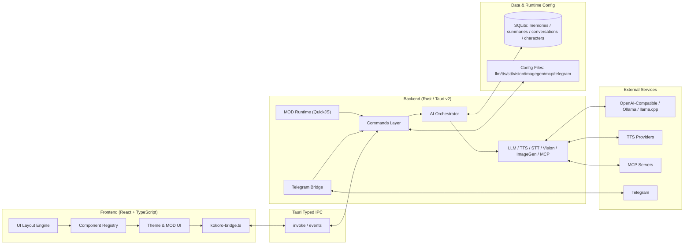

<div align="center">
  <a href="README.md">简体中文</a> | <a href="README_ZH-TW.md">繁體中文</a> | <a href="README_EN.md">English</a> | <a href="README_JA.md">日本語</a> | <a href="README_KO.md">한국어</a> | <a href="README_RU.md">Русский</a>
</div>

<br/>

<p align="center">
  
</p>

<h1 align="center">Kokoro Engine</h1>
<p align="center"><strong>Open-source immersive character engine for desktop AI companions.</strong></p>
<p align="center">専用の AI チャット伴侶を求めるユーザー向けの、クロスプラットフォーム仮想キャラクター対話エンジン。</p>

<p align="center">
  <a href="https://t.me/+U39dgiUspCo2NDNh"></a>
  
  
  
  
</p>

<p align="center">
  <a href="#-クイックスタート">クイックスタート</a> ·
  <a href="https://github.com/chyinan/Kokoro-Engine/releases">リリースをダウンロード</a> ·
  <a href="#-技術アーキテクチャ">アーキテクチャ</a> ·
  <a href="#-コントリビューション">コントリビューション</a>
</p>

---

## Kokoro Engine の独自性

Kokoro Engine は「チャット UI + デスクトップペットの見た目」ではありません。完全なデスクトップキャラクター実行環境です。

- **All-in-one**：Live2D、LLM、TTS、STT を 1 つの実行ループに統合。
- **Built for extensibility**：高自由度の MOD システム + MCP プロトコル。
- **Local-first**：ローカル記憶、オフライン優先、制御しやすいデータ経路。

## 一覧

| 項目 | 内容 |
|---|---|
| 対象ユーザー | 仮想キャラクター制作者、開発者、一般ユーザー |
| 交互作用 | テキスト、音声、画像、ビジョン入力、マルチモーダル対話 |
| 拡張方式 | MOD（HTML/CSS/JS + QuickJS）、MCP Servers |
| 技術スタック | React + TypeScript + Rust + Tauri v2 + SQLite |
| 言語サポート | 简体中文 / 繁體中文 / English / 日本語 / 한국어 / Русский |

## 📸 UIスクリーンショット

<div align="center">
  
  <p><em>メイン画面</em></p>
  
  <p><em>設定画面</em></p>
</div>

## 🚀 クイックスタート

### パス 1：リリース版をダウンロード（推奨）

[Releases ページ](https://github.com/chyinan/Kokoro-Engine/releases) から対象プラットフォームのインストーラーを取得して実行します。

### パス 2：ソースからビルド

#### 必要環境

- [Node.js](https://nodejs.org/)（v18+）
- [Rust](https://www.rust-lang.org/tools/install)（stable）

#### インストールと起動

```bash
git clone https://github.com/chyinan/kokoro-engine.git
cd kokoro-engine
npm install
npm run tauri dev
```

#### リリースビルド

```bash
npm run tauri build
```

### パス 3：Nix / Flakes（Linux のみ）

```bash
nix develop
npm install
npm run tauri dev
```

Nix の詳細は [docs/nix.md](docs/nix.md) を参照してください。

## ✨ コア機能

### キャラクターランタイム

- Live2D 描画、視線追跡、モーショントリガー、デスクトップ浮遊。
- モデルのホットスイッチと対話状態の復元。

### AI ブレイン

- Ollama、llama.cpp と OpenAI / Anthropic 互換プロトコルAPIインターフェースをサポート。
- マルチモーダル入力、文脈回想、長期記憶、感情状態の継続。

### 音声スタック

- TTS（テキスト読み上げ）：GPT-SoVITS、VITS、OmniVoice、OpenAI、Azure、ElevenLabs、Edge TTS、Browser TTS。
- STT（音声認識）：Whisper / faster-whisper / whisper.cpp / SenseVoice。
- VAD 自動停止とウェイクワード連携をサポート。

### 拡張性

- MOD フレームワーク：HTML/CSS/JS UI 差し替え + QuickJS スクリプトサンドボックス。
- MCP サポート：MCP Server 接続と外部ツール呼び出し。
- 公式デモ MOD：`mods/genshin-theme` を同梱。

### リモート連携

- Telegram、Discord、LINE、Webhook の4種類の Bot サービスを内蔵。
- テキスト、音声、画像メッセージをフル AI パイプラインへ橋渡し。

## 🏗️ 技術アーキテクチャ



- フロントエンド：宣言的レイアウト、コンポーネント登録、テーマシステム、MOD UI 注入。
- バックエンド：コマンドモジュール + AI オーケストレーション（LLM/TTS/STT/Vision/ImageGen/MCP）。
- データ層：SQLite を土台にしたローカルファーストの記憶レイヤーで、キャラクター・会話・要約・長期記憶を永続化し、`embedding + FTS5 BM25 + RRF` のハイブリッド検索で安定した長期対話コンテキストを提供します。夢の整理はルールベースの抽出、LLM レビュー、定時/手動ジョブを組み合わせ、重複・衝突・統合可能な記憶を継続的に管理します。

詳細は [docs/architecture.md](docs/architecture.md) を参照してください。

## 🗺️ ロードマップ

### 現在

- クロスプラットフォーム安定性・互換性の検証（Windows / Linux / macOS）。
- オンラインサービス連携の深度テスト。
- 記憶システムとマルチモーダル体験の継続最適化。

### 次の段階

- キャラクターマーケット / ワークショップ。
- モバイル対応探索（iOS / Android）。
- 開発者向け拡張エコシステムの強化。

## 🤝 コントリビューション

以下の形で参加できます。

1. **Pull requests**：不具合修正・機能追加。
2. **Issues**：問題報告と改善提案。
3. **Discussions**：アイデアや実践知の共有。
4. **Design contributions**：ロゴやビジュアル素材の提供。

## 💬 コミュニティ

👉 [**Kokoro Engine 公式 Telegram グループ**](https://t.me/+U39dgiUspCo2NDNh)

## ❤️ スポンサー

👉 [**スポンサー方法 / Sponsor**](SPONSOR.md)

## 🎉 特別な謝意

Kokoro Engine への貢献に感謝します。

<table align="center">
  <tr>
    <td align="center">
      <a href="https://github.com/aegbirou">
        
      </a>
      <br />
      <sub>@aegbirou</sub>
    </td>
    <td align="center">
      <a href="https://github.com/Initsnow">
        
      </a>
      <br />
      <sub>@Initsnow</sub>
    </td>
  </tr>
</table>


## 📄 ライセンス

コアコードは **MIT License** で公開されています。

### ⚠️ Live2D Cubism SDK に関する注意

本プロジェクトは **Live2D Cubism SDK** を使用しており、関連部分は Live2D Inc. に帰属します。コンパイル、配布、改変時は以下のライセンスを遵守してください。

- [Live2D Proprietary Software License Agreement](https://www.live2d.com/eula/live2d-proprietary-software-license-agreement_en.html)
- [Live2D Open Software License Agreement](https://www.live2d.com/eula/live2d-open-software-license-agreement_en.html)

> 年間売上高が 1,000 万円を超える中・大規模企業は、Live2D Inc. との別途商用ライセンス契約が必要になる場合があります。

### ⚠️ 同梱 Live2D サンプルモデルに関する注意

同梱の標準モデル **Hiyori Momose - PRO** は Live2D 公式サンプルデータです。このサンプルモデルの利用は Live2D Free Material License Agreement およびサンプルデータ利用条件に従います。

- [Live2D Sample Data](https://www.live2d.com/en/learn/sample/)
- [Live2D Sample Model Terms](https://www.live2d.com/en/learn/sample/model-terms/)

クレジット: Illustration: Kani Biimu / Modeling: Live2D。Hiyori Momose のキャラクターデザインを改変しないでください。一般ユーザーまたは小規模事業者以外の利用者は、Live2D Inc. の追加許可が必要か確認してください。

---

**Kokoro Engine** is an open-source project.
Live2D is a registered trademark of Live2D Inc.
