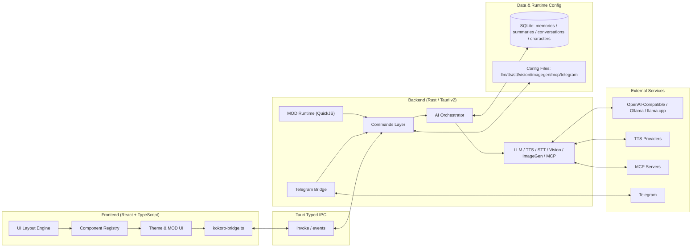

<div align="center">
  <a href="README.md">简体中文</a> | <a href="README_ZH-TW.md">繁體中文</a> | <a href="README_EN.md">English</a> | <a href="README_JA.md">日本語</a> | <a href="README_KO.md">한국어</a> | <a href="README_RU.md">Русский</a>
</div>

<br/>

<p align="center">
  
</p>

<h1 align="center">Kokoro Engine</h1>
<p align="center"><strong>Open-source immersive character engine for desktop AI companions.</strong></p>
<p align="center">전용 AI 채팅 동반자를 원하는 사용자를 위한 크로스플랫폼 가상 캐릭터 상호작용 엔진.</p>

<p align="center">
  <a href="https://t.me/+U39dgiUspCo2NDNh"></a>
  
  
  
  
</p>

<p align="center">
  <a href="#-빠른-시작">빠른 시작</a> ·
  <a href="https://github.com/chyinan/Kokoro-Engine/releases">릴리스 다운로드</a> ·
  <a href="#-기술-아키텍처">아키텍처</a> ·
  <a href="#-기여하기">기여하기</a>
</p>

---

## Kokoro Engine의 차별점

Kokoro Engine은 단순한 채팅 껍데기 + 데스크톱 펫 스킨이 아닙니다. 완전한 데스크톱 캐릭터 런타임입니다.

- **All-in-one**: Live2D, LLM, TTS, STT를 하나의 런타임 루프로 통합.
- **Built for extensibility**: 고자유도 MOD 시스템 + MCP 프로토콜.
- **Local-first**: 로컬 메모리 저장, 오프라인 우선, 제어 가능한 데이터 경로.

## 한눈에 보기

| 항목 | 내용 |
|---|---|
| 대상 사용자 | 가상 캐릭터 크리에이터, 개발자, 일반 사용자 |
| 상호작용 | 텍스트, 음성, 이미지, 비전 입력, 멀티모달 대화 |
| 확장 방식 | MOD (HTML/CSS/JS + QuickJS), MCP Servers |
| 기술 스택 | React + TypeScript + Rust + Tauri v2 + SQLite |
| 언어 지원 | 简体中文 / 繁體中文 / English / 日本語 / 한국어 / Русский |

## 📸 UI 스크린샷

<div align="center">
  
  <p><em>메인 화면</em></p>
  
  <p><em>설정 화면</em></p>
</div>

## 🚀 빠른 시작

### 경로 1: 릴리스 다운로드 (권장)

[Releases 페이지](https://github.com/chyinan/Kokoro-Engine/releases)에서 플랫폼별 설치 파일을 다운로드해 실행하세요.

### 경로 2: 소스에서 빌드

#### 요구 사항

- [Node.js](https://nodejs.org/) (v18+)
- [Rust](https://www.rust-lang.org/tools/install) (stable)

#### 설치 및 실행

```bash
git clone https://github.com/chyinan/kokoro-engine.git
cd kokoro-engine
npm install
npm run tauri dev
```

#### 릴리스 빌드

```bash
npm run tauri build
```

### 경로 3: Nix / Flakes (Linux 전용)

```bash
nix develop
npm install
npm run tauri dev
```

Nix 상세 내용은 [docs/nix.md](docs/nix.md)를 참고하세요.

## ✨ 핵심 기능

### 캐릭터 런타임

- Live2D 렌더링, 시선 추적, 모션 트리거, 데스크톱 플로팅 모드.
- 모델 핫스위칭과 상호작용 상태 복원.

### AI 브레인

- Ollama, llama.cpp 및 OpenAI / Anthropic 호환 프로토콜 API 인터페이스 지원.
- 멀티모달 입력, 컨텍스트 회수, 장기 기억, 감정 상태 연속성.

### 음성 스택

- TTS(텍스트 음성 변환): GPT-SoVITS, VITS, OpenAI, Azure, ElevenLabs, Edge TTS, Browser TTS.
- STT(음성 텍스트 변환): Whisper / faster-whisper / whisper.cpp / SenseVoice.
- VAD 자동 정지 및 웨이크워드 흐름 지원.

### 확장성

- MOD 프레임워크: HTML/CSS/JS UI 교체 + QuickJS 스크립트 샌드박스.
- MCP 지원: MCP Server 연결 및 외부 도구 호출.
- 공식 데모 MOD 내장: `mods/genshin-theme`.

### 원격 상호작용

- Telegram Bot 서비스 내장.
- 텍스트, 음성, 이미지 메시지를 전체 AI 파이프라인으로 브리지.

## 🏗️ 기술 아키텍처



- 프론트엔드: 선언형 레이아웃, 컴포넌트 등록, 테마 시스템, MOD UI 주입.
- 백엔드: 명령 모듈 + AI 오케스트레이션(LLM/TTS/STT/Vision/ImageGen/MCP).
- 데이터 계층: SQLite 기반의 로컬 우선 메모리 레이어로 캐릭터, 대화, 요약, 장기 기억을 영속화하고, `embedding + FTS5 BM25 + RRF` 하이브리드 검색으로 안정적인 장기 대화 컨텍스트를 제공합니다. 꿈 정리는 규칙 기반 선별, LLM 검토, 예약/수동 작업을 결합해 중복, 충돌, 병합 가능한 기억을 지속적으로 관리합니다.

자세한 설계는 [docs/architecture.md](docs/architecture.md)를 참고하세요.

## 🗺️ 로드맵

### 현재

- 크로스플랫폼 안정성 및 호환성 검증(Windows / Linux / macOS).
- 온라인 서비스 파이프라인 심화 테스트.
- 기억 시스템과 멀티모달 경험 지속 최적화.

### 다음 단계

- 캐릭터 마켓 / 워크숍.
- 모바일 지원 탐색(iOS / Android).
- 개발자 확장 생태계 강화.

## 🤝 기여하기

다음 방식으로 참여할 수 있습니다.

1. **Pull requests**: 문제 수정 또는 기능 추가.
2. **Issues**: 버그 제보 및 개선 제안.
3. **Discussions**: 아이디어와 실전 경험 공유.
4. **Design contributions**: 로고/비주얼 에셋 기여.

## 💬 커뮤니티

👉 [**Kokoro Engine 공식 Telegram 그룹**](https://t.me/+U39dgiUspCo2NDNh)

## ❤️ 후원

👉 [**후원 방법 / Sponsor**](SPONSOR.md)

## 🎉 특별 감사

Kokoro Engine에 기여해 주신 모든 분들께 감사드립니다.

<table align="center">
  <tr>
    <td align="center">
      <a href="https://github.com/aegbirou">
        
      </a>
      <br />
      <sub>@aegbirou</sub>
    </td>
    <td align="center">
      <a href="https://github.com/Initsnow">
        
      </a>
      <br />
      <sub>@Initsnow</sub>
    </td>
  </tr>
</table>


## 📄 라이선스

핵심 코드는 **MIT License**를 따릅니다.

### ⚠️ Live2D Cubism SDK 고지

본 프로젝트는 **Live2D Cubism SDK**를 사용하며 관련 부분은 Live2D Inc.에 귀속됩니다. 컴파일, 배포, 수정 시 아래 라이선스를 준수해야 합니다.

- [Live2D Proprietary Software License Agreement](https://www.live2d.com/eula/live2d-proprietary-software-license-agreement_en.html)
- [Live2D Open Software License Agreement](https://www.live2d.com/eula/live2d-open-software-license-agreement_en.html)

> 연 매출 1,000만 엔을 초과하는 중대형 기업은 Live2D Inc.와 별도 상용 라이선스 계약이 필요할 수 있습니다.

### ⚠️ 포함된 Live2D 샘플 모델 고지

기본 모델로 포함된 **Hiyori Momose - PRO**는 Live2D 공식 샘플 데이터입니다. 이 샘플 모델의 사용은 Live2D Free Material License Agreement 및 샘플 데이터 약관을 따릅니다.

- [Live2D Sample Data](https://www.live2d.com/en/learn/sample/)
- [Live2D Sample Model Terms](https://www.live2d.com/en/learn/sample/model-terms/)

크레딧: Illustration: Kani Biimu / Modeling: Live2D. Hiyori Momose의 캐릭터 디자인을 수정하지 마세요. 일반 사용자 또는 소규모 사업자가 아닌 사용자는 Live2D Inc.의 추가 허가가 필요한지 확인해야 합니다.

---

**Kokoro Engine** is an open-source project.
Live2D is a registered trademark of Live2D Inc.
