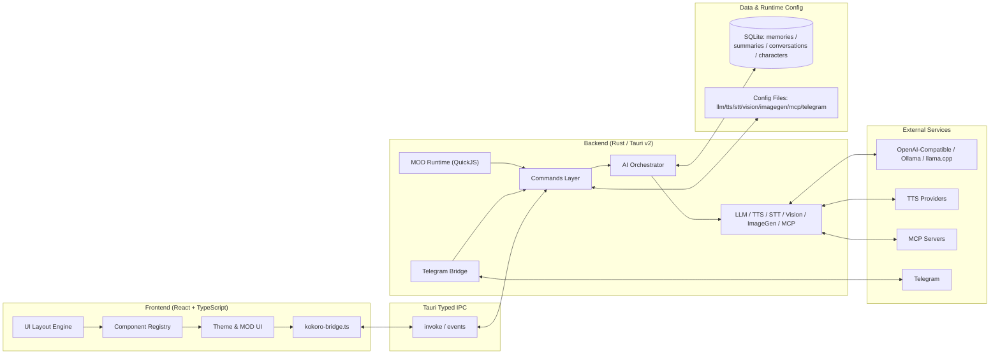

<div align="center">
  <a href="README.md">简体中文</a> | <a href="README_ZH-TW.md">繁體中文</a> | <a href="README_EN.md">English</a> | <a href="README_JA.md">日本語</a> | <a href="README_KO.md">한국어</a> | <a href="README_RU.md">Русский</a>
</div>

<br/>

<p align="center">
  
</p>

<h1 align="center">Kokoro Engine</h1>
<p align="center"><strong>Open-source immersive character engine for desktop AI companions.</strong></p>
<p align="center">Кроссплатформенный движок взаимодействия с виртуальным персонажем для пользователей, которым нужен персональный AI-компаньон.</p>

<p align="center">
  <a href="https://t.me/+U39dgiUspCo2NDNh"></a>
  
  
  
  
</p>

<p align="center">
  <a href="#-быстрый-старт">Быстрый старт</a> ·
  <a href="https://github.com/chyinan/Kokoro-Engine/releases">Скачать релиз</a> ·
  <a href="#-техническая-архитектура">Архитектура</a> ·
  <a href="#-вклад-в-проект">Вклад</a>
</p>

---

## Уникальность Kokoro Engine

Kokoro Engine — это не просто чат-оболочка с внешним видом desktop pet. Это полноценный десктопный runtime персонажа:

- **All-in-one**: Live2D, LLM, TTS и STT объединены в единый runtime-контур.
- **Built for extensibility**: высокогибкая MOD-система + MCP-протокол.
- **Local-first**: локальная память, офлайн-приоритет и контролируемый путь данных.

## Кратко

| Измерение | Содержание |
|---|---|
| Целевая аудитория | создатели виртуальных персонажей, разработчики, обычные пользователи |
| Форматы взаимодействия | текст, голос, изображения, vision-вход, мультимодальный диалог |
| Модель расширения | MOD (HTML/CSS/JS + QuickJS), MCP Servers |
| Технологии | React + TypeScript + Rust + Tauri v2 + SQLite |
| Поддержка языков | 简体中文 / 繁體中文 / English / 日本語 / 한국어 / Русский |

## 📸 Скриншоты интерфейса

<div align="center">
  
  <p><em>Главный экран</em></p>
  
  <p><em>Экран настроек</em></p>
</div>

## 🚀 Быстрый старт

### Путь 1: скачать релиз (рекомендуется)

Перейдите на [страницу Releases](https://github.com/chyinan/Kokoro-Engine/releases), скачайте установщик под вашу платформу и запустите его.

### Путь 2: собрать из исходников

#### Требования

- [Node.js](https://nodejs.org/) (v18+)
- [Rust](https://www.rust-lang.org/tools/install) (stable)

#### Установка и запуск

```bash
git clone https://github.com/chyinan/kokoro-engine.git
cd kokoro-engine
npm install
npm run tauri dev
```

#### Сборка релиза

```bash
npm run tauri build
```

### Путь 3: Nix / Flakes (только Linux)

```bash
nix develop
npm install
npm run tauri dev
```

Подробнее по Nix: [docs/nix.md](docs/nix.md).

## ✨ Ключевые возможности

### Рантайм персонажа

- Рендеринг Live2D, отслеживание взгляда, триггеры движений, плавающий режим на рабочем столе.
- Горячее переключение моделей и восстановление состояния взаимодействия.

### AI-мозг

- Поддержка Ollama, llama.cpp и протокольных API-интерфейсов, совместимых с OpenAI и Anthropic.
- Мультимодальный вход, возврат контекста, долгосрочная память и непрерывность эмоционального состояния.

### Голосовой стек

- TTS (текст в речь): GPT-SoVITS, VITS, OmniVoice, OpenAI, Azure, ElevenLabs, Edge TTS, Browser TTS.
- STT (речь в текст): Whisper / faster-whisper / whisper.cpp / SenseVoice.
- Поддержка VAD-автоостановки и wake-word цепочки.

### Расширяемость

- MOD-фреймворк: замена UI на HTML/CSS/JS + песочница скриптов QuickJS.
- MCP-поддержка: подключение MCP Server и вызов внешних инструментов.
- Встроенный официальный демо-MOD: `mods/genshin-theme`.

### Удалённое взаимодействие

- Встроенные Bot-сервисы для Telegram, Discord, LINE и Webhook.
- Мост для текстовых, голосовых и image-сообщений в полный AI-пайплайн.

## 🏗️ Техническая архитектура



- Фронтенд: декларативный layout, реестр компонентов, тема, MOD UI injection.
- Бэкенд: командные модули + AI orchestration (LLM/TTS/STT/Vision/ImageGen/MCP).
- Слой данных: локально-ориентированный слой памяти на базе SQLite, который сохраняет персонажей, диалоги, сводки и долгосрочную память, а гибридный поиск `embedding + FTS5 BM25 + RRF` даёт стабильный долгосрочный контекст. Консолидация во сне сочетает правила первичного отбора, проверку LLM и ручные/плановые задания для постоянного управления дубликатами, конфликтами и объединяемыми воспоминаниями.

Подробности: [docs/architecture.md](docs/architecture.md).

## 🗺️ Дорожная карта

### Сейчас

- Проверка стабильности и совместимости на Windows / Linux / macOS.
- Глубокое тестирование онлайн-сервисных цепочек.
- Постоянная оптимизация памяти и мультимодального опыта.

### Далее

- Маркет/мастерская персонажей.
- Исследование мобильной поддержки (iOS / Android).
- Усиление экосистемы расширений для разработчиков.

## 🤝 Вклад в проект

Вы можете участвовать так:

1. **Pull requests**: исправления и новые функции.
2. **Issues**: баг-репорты и предложения по улучшению.
3. **Discussions**: обмен идеями и практикой.
4. **Design contributions**: логотип и визуальные материалы.

## 💬 Сообщество

👉 [**Официальная Telegram-группа Kokoro Engine**](https://t.me/+U39dgiUspCo2NDNh)

## ❤️ Поддержка

👉 [**Способы поддержки / Sponsor**](SPONSOR.md)

## 🎉 Особая благодарность

Спасибо всем участникам за вклад в Kokoro Engine.

<table align="center">
  <tr>
    <td align="center">
      <a href="https://github.com/aegbirou">
        
      </a>
      <br />
      <sub>@aegbirou</sub>
    </td>
    <td align="center">
      <a href="https://github.com/Initsnow">
        
      </a>
      <br />
      <sub>@Initsnow</sub>
    </td>
  </tr>
</table>


## 📄 Лицензия

Основной код проекта распространяется по **MIT License**.

### ⚠️ Уведомление о Live2D Cubism SDK

Проект использует **Live2D Cubism SDK**, а связанные части принадлежат Live2D Inc. При компиляции, распространении и модификации проекта необходимо соблюдать лицензии Live2D:

- [Live2D Proprietary Software License Agreement](https://www.live2d.com/eula/live2d-proprietary-software-license-agreement_en.html)
- [Live2D Open Software License Agreement](https://www.live2d.com/eula/live2d-open-software-license-agreement_en.html)

> Для компаний с годовой выручкой выше 10 млн иен может потребоваться отдельное коммерческое лицензионное соглашение с Live2D Inc.

### ⚠️ Уведомление о встроенной примерной модели Live2D

Встроенная модель по умолчанию **Hiyori Momose - PRO** является официальным примером данных Live2D. Использование этой модели регулируется Live2D Free Material License Agreement и условиями использования sample data.

- [Live2D Sample Data](https://www.live2d.com/en/learn/sample/)
- [Live2D Sample Model Terms](https://www.live2d.com/en/learn/sample/model-terms/)

Кредиты: Illustration: Kani Biimu / Modeling: Live2D. Не изменяйте дизайн персонажа Hiyori Momose. Пользователям, не относящимся к General Users или Small-Scale Enterprise Users, следует проверить, требуется ли дополнительное разрешение Live2D Inc.

---

**Kokoro Engine** is an open-source project.
Live2D is a registered trademark of Live2D Inc.
