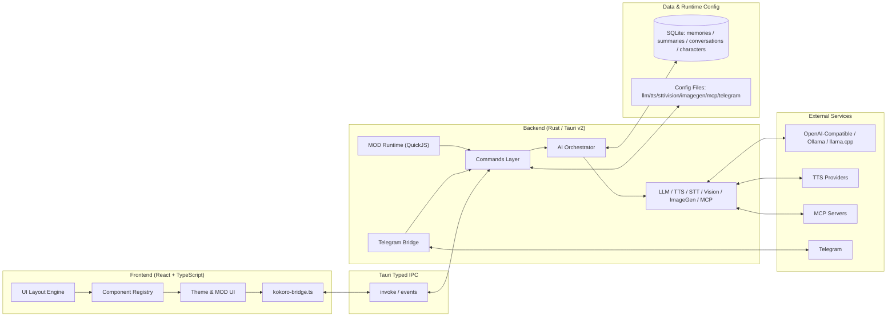

<div align="center">
  <a href="README.md">简体中文</a> | <a href="README_ZH-TW.md">繁體中文</a> | <a href="README_EN.md">English</a> | <a href="README_JA.md">日本語</a> | <a href="README_KO.md">한국어</a> | <a href="README_RU.md">Русский</a>
</div>

<br/>

<p align="center">
  
</p>

<h1 align="center">Kokoro Engine</h1>
<p align="center"><strong>Open-source immersive character engine for desktop AI companions.</strong></p>
<p align="center">為每一位想擁有專屬 AI 聊天伴侶的使用者打造的跨平台虛擬角色互動引擎。</p>

<p align="center">
  <a href="https://t.me/+U39dgiUspCo2NDNh"></a>
  
  
  
  
</p>
<p align="center">
  <a href="#-快速開始">快速開始</a> ·
  <a href="https://github.com/chyinan/Kokoro-Engine/releases">下載安裝</a> ·
  <a href="#-技術架構">架構</a> ·
  <a href="#-參與貢獻">貢獻</a>
</p>

---

## Kokoro Engine 的獨到之處

Kokoro Engine 不是「聊天外殼 + 桌寵皮膚」。它是一個完整的桌面角色執行環境：

- **All-in-one**：Live2D、LLM、TTS、STT 等技術整合在同一個執行時閉環。
- **Built for extensibility**：高自由度 MOD 系統 + MCP 協定，天然面向擴充。
- **Local-first**：本機儲存記憶、離線優先、資料鏈路可控。

## 一覽

| 維度 | 內容 |
|---|---|
| 面向使用者 | 虛擬角色創作者、開發者、一般使用者 |
| 互動能力 | 文字、語音、圖片、視覺輸入、多模態對話 |
| 擴充方式 | MOD（HTML/CSS/JS + QuickJS）、MCP Servers |
| 技術棧 | React + TypeScript + Rust + Tauri v2 + SQLite |
| 語言支援 | 简体中文 / 繁體中文 / English / 日本語 / 한국어 / Русский |

## 📸 UI 截圖

<div align="center">
  
  <p><em>主畫面</em></p>
  
  <p><em>設定畫面</em></p>
</div>

## 🚀 快速開始

### 路徑一：下載發行版（推薦）

前往 [Releases 頁面](https://github.com/chyinan/Kokoro-Engine/releases) 下載對應平台安裝包後直接執行。

### 路徑二：從原始碼建置

#### 環境需求

- [Node.js](https://nodejs.org/)（v18+）
- [Rust](https://www.rust-lang.org/tools/install)（stable）

#### 安裝與執行

```bash
git clone https://github.com/chyinan/kokoro-engine.git
cd kokoro-engine
npm install
npm run tauri dev
```

#### 建置發行版

```bash
npm run tauri build
```

### 路徑三：Nix / Flakes（僅 Linux）

```bash
nix develop
npm install
npm run tauri dev
```

更多 Nix 用法請參閱 [docs/nix.md](docs/nix.md)。

## ✨ 核心能力

### 互動引擎

- Live2D 渲染、視線追蹤、動作觸發、桌面浮窗
- 模型熱切換、幀率自訂

### 多維架構

- 支援 Ollama、llama.cpp 與 OpenAI、Anthropic 相容協定 API 介面
- 支援多模態輸入、上下文回溯、長期記憶與情感狀態

### 音訊互動

- TTS（文字轉語音）：GPT-SoVITS、VITS、OpenAI、Azure、ElevenLabs、Edge TTS、Browser TTS
- STT（語音轉文字）：Whisper / faster-whisper / whisper.cpp / SenseVoice
- 支援 VAD 自動停錄與喚醒詞鏈路

### 可擴充性

- MOD 框架：HTML/CSS/JS 超高自由度 UI 主題替換 + QuickJS 腳本沙箱
- MCP 支援：連接 MCP Server 並呼叫外部工具
- 內建官方示範 MOD：`mods/genshin-theme`

### 遠端連線

- 內建 Telegram Bot 服務
- 文字、語音、圖片訊息完整橋接到 AI 管線流

## 🏗️ 技術架構



- 前端：宣告式布局、元件註冊、主題系統、MOD UI 注入
- 後端：命令模組 + 多模態編排（LLM/TTS/STT/Vision/ImageGen/MCP）
- 資料層：以 SQLite 為底座建構本機優先記憶層，統一持久化角色、會話、摘要與長期記憶，並透過 `embedding + FTS5 BM25 + RRF` 混合檢索提供穩定長期上下文；夢境整理結合規則篩選、LLM 複核與定時/手動任務，對重複、衝突和可合併記憶進行持續治理。

詳細設計請參閱 [docs/architecture.md](docs/architecture.md)。

## 🗺️ 路線圖

### 現在

- 跨平台穩定性與相容性驗證（Windows / Linux / macOS）
- 線上服務鏈路深度測試
- 記憶系統與多模態體驗持續最佳化

### 下一步

- 角色市場 / 工坊
- 行動端支援探索（iOS / Android）
- 開發者擴充生態增強

## 🤝 參與貢獻

歡迎透過以下方式參與：

1. **Pull Requests**：修復問題或新增功能。
2. **Issues**：提交問題與改進建議。
3. **Discussions**：分享想法與實踐。
4. **Design contributions**：歡迎提供 Logo / 視覺資產。

## 💬 社群

👉 [**Kokoro Engine 官方討論群（Telegram）**](https://t.me/+U39dgiUspCo2NDNh)

## ❤️ 贊助

👉 [**查看贊助方式 / Sponsor**](SPONSOR.md)

## 🎉 特別鳴謝

感謝所有為 Kokoro Engine 做出貢獻的貢獻者。

<table align="center">
  <tr>
    <td align="center">
      <a href="https://github.com/aegbirou">
        
      </a>
      <br />
      <sub>@aegbirou</sub>
    </td>
    <td align="center">
      <a href="https://github.com/Initsnow">
        
      </a>
      <br />
      <sub>@Initsnow</sub>
    </td>
  </tr>
</table>

## 📄 授權協議

本專案核心程式碼遵循 **MIT License**。

### ⚠️ Live2D Cubism SDK 聲明

本專案使用 **Live2D Cubism SDK**，相關部分歸 Live2D Inc. 所有。使用本專案（包括編譯、散布、修改）時，請遵守 Live2D 授權協議：

- [Live2D Proprietary Software License Agreement](https://www.live2d.com/eula/live2d-proprietary-software-license-agreement_en.html)
- [Live2D Open Software License Agreement](https://www.live2d.com/eula/live2d-open-software-license-agreement_en.html)

> 若您屬於年營業額超過 1000 萬日圓的中大型企業，可能需要與 Live2D Inc. 簽署單獨商業授權協議。

### ⚠️ 內建 Live2D 範例模型聲明

本專案內建的預設模型 **Hiyori Momose - PRO** 來自 Live2D 官方範例資料。該範例模型的使用受 Live2D Free Material License Agreement 與範例資料條款約束：

- [Live2D Sample Data](https://www.live2d.com/en/learn/sample/)
- [Live2D Sample Model Terms](https://www.live2d.com/en/learn/sample/model-terms/)

版權資訊：Illustration: Kani Biimu / Modeling: Live2D。請勿修改 Hiyori Momose 的角色設計。非一般使用者或小規模企業使用者使用時，請自行確認是否需要 Live2D Inc. 的額外授權。

---

**Kokoro Engine** is an open-source project.
Live2D is a registered trademark of Live2D Inc.
