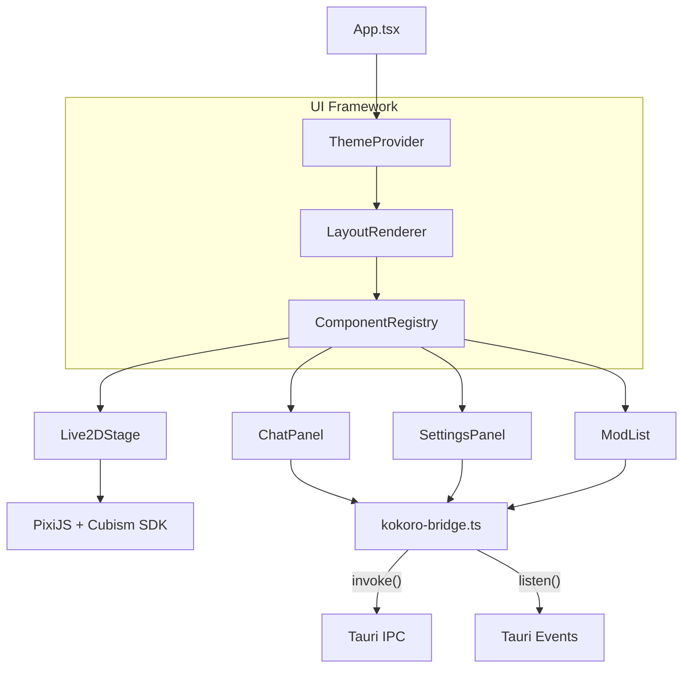
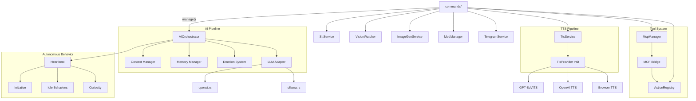
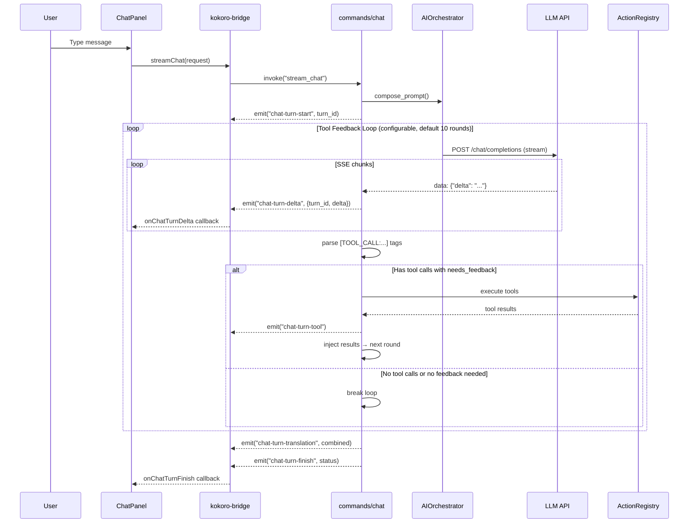
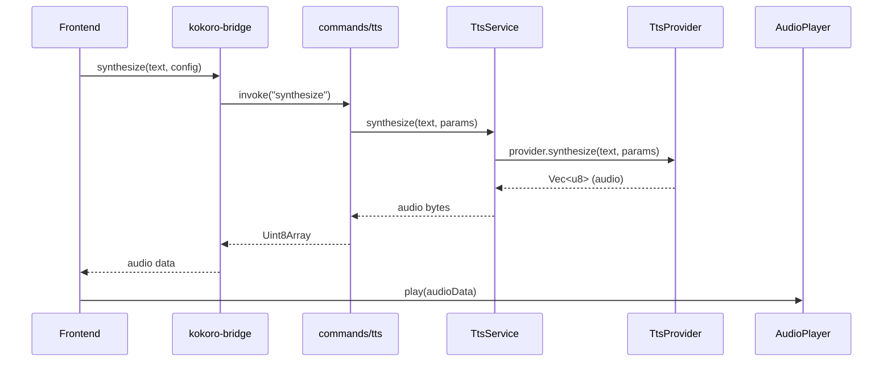

# Kokoro Engine — Architecture

> **Version:** 2.2
> **Last Updated:** 2026-04-09
> **Companion Document:** [PRD.md](PRD.md) · [API Specification](API%20specification.md) · [MOD System Design](MOD_system_design.md)

---

## 1. High-Level Overview

Kokoro Engine is a **Tauri v2 desktop application** with a dual-layer architecture: a React + TypeScript frontend and a Rust backend, communicating over a typed IPC bridge. It integrates Live2D rendering, LLM conversation, TTS/STT, Vision, Image Generation, MCP protocol, and a MOD system.

```
┌──────────────────────────────────────────────────────────────────────┐
│                           Tauri Window                               │
│  ┌────────────────────────────────────────────────────────────────┐  │
│  │                Frontend  (React + TypeScript)                  │  │
│  │                                                                │  │
│  │  ┌─────────┐ ┌────────┐ ┌──────┐ ┌───────┐ ┌──────────────┐  │  │
│  │  │ Live2D  │ │  Chat  │ │ Mods │ │ Theme │ │   Settings   │  │  │
│  │  │ Viewer  │ │ Panel  │ │ List │ │Engine │ │    Panel     │  │  │
│  │  └────┬────┘ └───┬────┘ └──┬───┘ └───────┘ └──────┬───────┘  │  │
│  │       │          │         │                       │          │  │
│  │  ─────┴──────────┴─────────┴───────────────────────┴────────  │  │
│  │                  kokoro-bridge.ts  (Typed IPC)                 │  │
│  └──────────────────────────┬────────────────────────────────────┘  │
│                              │  Tauri invoke / events                │
│  ┌──────────────────────────┴────────────────────────────────────┐  │
│  │                  Backend  (Rust / Tauri v2)                    │  │
│  │                                                                │  │
│  │  ┌────────┐ ┌─────┐ ┌─────┐ ┌─────┐ ┌───────┐ ┌──────────┐  │  │
│  │  │   AI   │ │ LLM │ │ TTS │ │ STT │ │Vision │ │ ImageGen │  │  │
│  │  │Orchstr.│ │Adapt│ │ Svc │ │ Svc │ │Watcher│ │   Svc    │  │  │
│  │  └────────┘ └─────┘ └─────┘ └─────┘ └───────┘ └──────────┘  │  │
│  │  ┌────────┐ ┌─────┐ ┌─────────┐ ┌──────────┐ ┌───────────┐  │  │
│  │  │Actions │ │ MCP │ │  Mods   │ │ Memory   │ │  SQLite   │  │  │
│  │  │Registry│ │Client│ │ Manager │ │ Manager  │ │ +FastEmbed│  │  │
│  │  └────────┘ └─────┘ └─────────┘ └──────────┘ └───────────┘  │  │
│  └────────────────────────────────────────────────────────────────┘  │
└──────────────────────────────────────────────────────────────────────┘
```

---

## 2. Project Structure

### 2.1 Frontend (`src/`)

```
src/
├── App.tsx                        # Root — MOD system orchestration + layout
├── main.tsx                       # React entry point
├── index.css                      # Global styles
│
├── core/                          # Service initialization & singletons
│   ├── init.tsx                   # Component registration bootstrap
│   ├── services.ts                # Service exports
│   ├── services/
│   │   ├── interaction-service.ts # User interaction handling
│   │   ├── mod-service.ts         # MOD lifecycle management
│   │   ├── tts-service.ts         # TTS service wrapper
│   │   └── voice-interrupt-service.ts
│   └── types/
│       └── mod.ts                 # Shared type definitions
│
├── features/live2d/               # Live2D rendering (PixiJS 6 + Cubism SDK)
│   ├── Live2DViewer.tsx           # Main Live2D component
│   ├── Live2DController.ts        # Model control & animation
│   ├── LipSyncProcessor.ts       # Mouth sync with audio
│   ├── DrawableHitTest.ts        # Drawable-level hit testing for body regions
│   └── AudioDebug.tsx             # Audio debugging UI
│
├── ui/
│   ├── layout/                    # Declarative layout engine (JSON-driven)
│   │   ├── LayoutRenderer.tsx     # JSON config → React component tree
│   │   └── types.ts               # LayoutNode, LayoutConfig, ThemeConfig
│   ├── registry/                  # Component registration (singleton)
│   │   └── ComponentRegistry.ts   # Core/MOD component registry
│   ├── theme/                     # Theme system (CSS variables)
│   │   ├── ThemeContext.tsx        # Theme provider & context
│   │   └── default.ts             # Default theme config
│   ├── mods/                      # MOD system integration
│   │   ├── ModMessageBus.ts       # iframe ↔ host message routing
│   │   ├── IframeSandbox.tsx      # iframe sandbox wrapper
│   │   └── ModList.tsx            # MOD list UI
│   ├── hooks/                     # React hooks
│   │   ├── useBackgroundSlideshow.ts
│   │   ├── useTypingReveal.ts
│   │   └── useVoiceInput.ts
│   ├── widgets/                   # UI components
│   │   ├── ChatPanel.tsx          # Chat interface (streaming + tool calls)
│   │   ├── ChatMessage.tsx        # Chat message bubble (edit, continue-from, regenerate)
│   │   ├── SettingsPanel.tsx      # Settings modal (persona/model/TTS/STT/vision/MCP/Telegram/pet/backup etc.)
│   │   ├── HeaderBar.tsx          # Top bar
│   │   ├── FooterBar.tsx          # Bottom bar (emotion display, real-time sync)
│   │   ├── BackgroundLayer.tsx    # Background rendering
│   │   ├── CharacterManager.tsx   # Character CRUD
│   │   ├── ConversationSidebar.tsx
│   │   ├── MemoryPanel.tsx        # Memory management UI
│   │   ├── ImageGenSettings.tsx   # Image generation settings
│   │   ├── memory/
│   │   │   ├── MemoryTimeline.tsx # Timeline view
│   │   │   └── MemoryGraph.tsx    # Keyword graph (CJK-aware)
│   │   └── settings/              # Settings tabs
│   │       ├── ApiTab.tsx         # LLM/API config (multi-provider, presets)
│   │       ├── TtsTab.tsx         # TTS provider setup
│   │       ├── SttTab.tsx         # Speech-to-text config
│   │       ├── ModelTab.tsx       # Live2D model selection
│   │       ├── BackgroundTab.tsx  # Background slideshow
│   │       ├── VisionTab.tsx      # Vision/screenshot config
│   │       ├── McpTab.tsx         # MCP server management
│   │       ├── JailbreakTab.tsx   # Jailbreak prompt config ({{char}}/{{user}} placeholders)
│   │       └── TelegramTab.tsx    # Telegram Bot config
│   ├── locales/                   # i18n (5 languages)
│   │   ├── zh.json                # Simplified Chinese
│   │   ├── en.json                # English
│   │   ├── ja.json                # Japanese
│   │   ├── ko.json                # Korean
│   │   └── ru.json                # Russian
│   └── i18n.ts                    # i18next configuration
│
├── lib/                           # Utilities & bridges
│   ├── kokoro-bridge.ts           # Typed IPC wrapper (all Tauri invoke calls)
│   ├── db.ts                      # IndexedDB for character storage
│   ├── audio-player.ts            # Audio playback utilities
│   ├── character-card-parser.ts   # Character card import (JSON/PNG)
│   └── utils.ts
│
└── components/ui/                 # Radix UI primitives
    └── button.tsx

Settings panel tabs currently include:
- persona, model, tts, stt, bg, imagegen
- vision, memory, mcp, mods, telegram
- api, jailbreak, pet, backup
```

### 2.2 Backend (`src-tauri/src/`)

```
src-tauri/src/
├── main.rs                        # Tauri entry point
├── lib.rs                         # Module exports & Tauri setup
│
├── commands/                      # IPC command modules (chat/system/config/media/integration)
│   ├── chat.rs                    # stream_chat + cancellation + tool approval flow
│   ├── context.rs                 # persona/language/proactive/session controls
│   ├── character.rs               # Runtime character state & cue control
│   ├── characters.rs              # Character CRUD
│   ├── conversation.rs            # Conversation history CRUD
│   ├── database.rs                # DB initialization & vector store test
│   ├── tts.rs                     # TTS synthesis/provider config/cache ops
│   ├── stt.rs                     # Speech-to-text + native mic/wake-word control
│   ├── llm.rs                     # LLM config & model listing
│   ├── vision.rs                  # Vision upload/watcher/capture controls
│   ├── imagegen.rs                # Image generation config + invocation
│   ├── mcp.rs                     # MCP server lifecycle & tool refresh
│   ├── mods.rs                    # MOD loading & lifecycle
│   ├── live2d.rs                  # Live2D model import/export/profile
│   ├── live2d_protocol.rs         # live2d:// protocol handler
│   ├── memory.rs                  # Memory CRUD & tiering
│   ├── actions.rs                 # Action registry & execution
│   ├── tool_settings.rs           # Tool enablement + max feedback rounds
│   ├── backup.rs                  # Data export/import
│   ├── auto_backup.rs             # Scheduled backup config + trigger
│   ├── pet.rs                     # Desktop pet & bubble window control
│   ├── system.rs                  # Engine info & system status
│   ├── telegram.rs                # Telegram Bot config & control
│   └── mod.rs
│
├── ai/                            # AI orchestration & autonomous behavior
│   ├── context.rs                 # AIOrchestrator — prompt assembly, context mgmt
│   ├── emotion.rs                 # Emotion state & personality model
│   ├── emotion_events.rs          # Emotion event types
│   ├── expression_driver.rs       # Expression → Live2D mapping
│   ├── memory.rs                  # Memory manager (vector DB + tiering)
│   ├── memory_extractor.rs        # Auto-extract memories from chat
│   ├── sentiment.rs               # Sentiment analysis
│   ├── style_adapter.rs           # Response style adaptation
│   ├── router.rs                  # Model routing (Fast/Smart/Cheap)
│   ├── prompts.rs                 # System prompt templates
│   ├── typing_sim.rs              # Typing animation simulation
│   ├── curiosity.rs               # Curiosity module (proactive questions)
│   ├── initiative.rs              # Initiative system (proactive talking)
│   ├── idle_behaviors.rs          # Idle action triggers
│   ├── heartbeat.rs               # Periodic background tasks
│   └── mod.rs
│
├── llm/                           # LLM adapters
│   ├── service.rs                 # LlmService (main interface)
│   ├── provider.rs                # LlmProvider trait
│   ├── openai.rs                  # OpenAI-compatible API adapter
│   ├── ollama.rs                  # Ollama local inference
│   ├── context.rs                 # LLM context management
│   ├── llm_config.rs              # Config persistence
│   └── mod.rs
│
├── tts/                           # Text-to-speech (router + provider adapters)
│   ├── manager.rs                 # TtsService (main interface)
│   ├── interface.rs               # TtsProvider trait & types
│   ├── router.rs                  # Provider routing logic
│   ├── config.rs                  # Config persistence
│   ├── cache.rs                   # Audio caching
│   ├── queue.rs                   # TTS queue management
│   ├── voice_registry.rs          # Voice profile registry
│   ├── emotion_tts.rs             # Emotion-aware TTS
│   ├── openai.rs                  # OpenAI TTS
│   ├── browser.rs                 # Browser TTS (Web Speech API)
│   ├── local_gpt_sovits.rs        # GPT-SoVITS local
│   ├── local_vits.rs              # VITS local
│   ├── cloud_base.rs              # Cloud provider base
│   └── mod.rs
│
├── stt/                           # Speech-to-text
│   ├── service.rs                 # SttService
│   ├── interface.rs               # SttProvider trait
│   ├── config.rs                  # Config persistence
│   ├── openai.rs                  # OpenAI Whisper
│   ├── whisper_cpp.rs             # Whisper.cpp local
│   ├── stream.rs                  # Audio streaming (chunked)
│   └── mod.rs
│
├── vision/                        # Screen capture & VLM analysis
│   ├── server.rs                  # Vision HTTP server
│   ├── capture.rs                 # xcap screenshot
│   ├── context.rs                 # Vision context
│   ├── config.rs                  # Config persistence
│   ├── watcher.rs                 # Screen change watcher (pixel diff)
│   └── mod.rs
│
├── imagegen/                      # Image generation
│   ├── service.rs                 # ImageGenService
│   ├── interface.rs               # ImageGenProvider trait
│   ├── config.rs                  # Config persistence
│   ├── openai.rs                  # OpenAI DALL-E
│   ├── stable_diffusion.rs        # Stable Diffusion WebUI
│   ├── google.rs                  # Google Gemini
│   └── mod.rs
│
├── mcp/                           # Model Context Protocol client
│   ├── manager.rs                 # McpManager (server lifecycle)
│   ├── client.rs                  # McpClient (JSON-RPC 2.0)
│   ├── transport.rs               # stdio + Streamable HTTP transport
│   ├── bridge.rs                  # MCP tools → ActionRegistry bridge
│   └── mod.rs
│
├── actions/                       # Action registry (LLM tool calling)
│   ├── registry.rs                # ActionHandler trait, ActionRegistry
│   ├── builtin.rs                 # Built-in actions (8 handlers)
│   └── mod.rs
│
├── mods/                          # MOD system (QuickJS sandbox)
│   ├── manager.rs                 # ModManager (lifecycle)
│   ├── manifest.rs                # mod.json parsing
│   ├── protocol.rs                # mod:// protocol handler
│   ├── theme.rs                   # Theme JSON parsing
│   ├── api.rs                     # QuickJS API (Kokoro.*)
│   └── mod.rs
│
├── telegram/                      # Telegram Bot remote interaction
│   ├── bot.rs                     # Bot core logic (message handling, voice/image bridge)
│   ├── config.rs                  # TelegramConfig (token, whitelist, options)
│   └── mod.rs                     # TelegramService lifecycle (start/stop)
│
├── config.rs                      # Global config types
└── utils/
    ├── http.rs                    # HTTP utilities
    └── mod.rs
```

### 2.3 MOD System (`mods/`)

```
mods/
├── default/                       # Default Hiyori character
│   ├── mod.json                   # Manifest
│   └── theme.json                 # Default theme variables
│
└── genshin-theme/                 # Genshin Impact UI theme (demo MOD)
    ├── mod.json                   # Manifest with component overrides
    ├── theme.json                 # Genshin color palette & animations
    ├── components/
    │   ├── chat.html              # Chat panel override (iframe)
    │   ├── settings.html          # Settings panel override
    │   └── style.css
    └── assets/
        └── HYWenHei-85W.ttf      # Genshin font
```

### 2.4 Database (SQLite + FastEmbed)

```
~/.local/share/com.chyin.kokoro/   # (or OS-appropriate app data dir)
├── kokoro.db                      # SQLite database
│   ├── memories                   # content, embedding, importance, tier, character_id
│   ├── conversations              # chat history
│   └── characters                 # character metadata
├── llm_config.json                # LLM provider config (multi-provider, presets)
├── tts_config.json
├── stt_config.json
├── vision_config.json
├── imagegen_config.json
├── mcp_servers.json
├── telegram_config.json           # Telegram Bot config (token, whitelist)
└── emotion_state.json             # Persisted emotion state across restarts
```

---

## 3. Layer Architecture

### 3.1 Frontend Layer



| Pattern | Implementation |
|---|---|
| **Declarative layout** | JSON config → `LayoutRenderer` → grid/layer/component tree |
| **Component registry** | `ComponentRegistry` — register-by-name, resolve at render time, MOD override support |
| **Theming** | `ThemeProvider` context with CSS variable injection, MOD theme override |
| **Typed IPC** | `kokoro-bridge.ts` wraps every `invoke()` with TypeScript types |
| **Event streaming** | Turn-scoped chat events (`onChatTurnStart`, `onChatTurnDelta`, `onChatTurnFinish`, `onChatTurnTranslation`, `onChatTurnTool`) plus `onChatCue` / `onChatError` via Tauri events |
| **i18n** | i18next with 5 languages (zh, en, ja, ko, ru) |

### 3.2 Backend Layer



| Pattern | Implementation |
|---|---|
| **Pluggable LLM** | OpenAI-compatible + Ollama adapters; Fast/Smart/Cheap model routing |
| **Pluggable TTS** | `TtsProvider` trait + capability router + fallback chain (preferred/default/browser) |
| **Pluggable ImageGen** | `ImageGenProvider` trait — Stable Diffusion, DALL-E, Gemini |
| **Tool calling** | `ActionHandler` trait with `needs_feedback()` for feedback loop control |
| **MCP integration** | MCP tools auto-registered into `ActionRegistry` via `bridge.rs` |
| **Managed state** | Tauri `app.manage()` — AIOrchestrator, TtsService, McpManager, etc. |
| **Async-first** | All I/O uses `tokio` async runtime; `Arc<RwLock<T>>` for shared state |
| **Mod isolation** | QuickJS ES2020 sandbox + iframe sandboxing for UI components |

---

## 4. IPC Contract

All frontend ↔ backend communication flows through **`kokoro-bridge.ts`** (frontend) and **`commands/`** (backend).

### Commands (invoke-based)

The command set is defined by `tauri::generate_handler![]` in `src-tauri/src/lib.rs`.

| Domain | Commands | Module |
|---|---|---|
| Chat turn | `stream_chat`, `cancel_chat_turn`, `approve_tool_approval`, `reject_tool_approval`, `get_context_settings`, `set_context_settings` | `chat.rs` |
| Context | `set_persona`, `set_character_name`, `set_active_character_id`, `set_user_name`, `set_response_language`, `set_user_language`, `set_jailbreak_prompt`, `get_jailbreak_prompt`, `set_proactive_enabled`, `get_proactive_enabled`, `set_memory_enabled`, `get_memory_enabled`, `clear_history`, `delete_last_messages`, `end_session` | `context.rs` |
| System + character | `get_engine_info`, `get_system_status`, `set_window_size`, `get_character_state`, `play_cue`, `send_message` | `system.rs`, `character.rs` |
| Database | `init_db`, `test_vector_store` | `database.rs` |
| TTS | `synthesize`, `list_tts_providers`, `list_tts_voices`, `get_tts_provider_status`, `clear_tts_cache`, `get_tts_config`, `save_tts_config`, `list_gpt_sovits_models` | `tts.rs` |
| STT | `transcribe_audio`, `get_stt_config`, `save_stt_config`, `transcribe_wake_word_audio`, `start_native_mic`, `stop_native_mic`, `start_native_wake_word`, `stop_native_wake_word`, `get_sensevoice_local_status`, `download_sensevoice_local_model` | `stt.rs` |
| STT streaming buffer | `process_audio_chunk`, `complete_audio_stream`, `discard_audio_stream`, `snapshot_audio_stream`, `prune_audio_buffer` | `stt/stream.rs` |
| LLM | `get_llm_config`, `save_llm_config`, `list_ollama_models` | `llm.rs` |
| Vision | `upload_vision_image`, `get_vision_config`, `save_vision_config`, `start_vision_watcher`, `stop_vision_watcher`, `capture_screen_now` | `vision.rs` |
| Image generation | `generate_image`, `get_imagegen_config`, `save_imagegen_config`, `test_sd_connection` | `imagegen.rs` |
| Memory | `list_memories`, `update_memory`, `delete_memory`, `update_memory_tier` | `memory.rs` |
| Character CRUD | `list_characters`, `create_character`, `update_character`, `delete_character`, `list_character_ids` | `characters.rs`, `conversation.rs` |
| Conversation CRUD | `list_conversations`, `load_conversation`, `delete_conversation`, `create_conversation`, `rename_conversation`, `update_conversation_state` | `conversation.rs` |
| Action / tooling | `list_actions`, `list_builtin_tools`, `execute_action`, `get_tool_settings`, `save_tool_settings` | `actions.rs`, `tool_settings.rs` |
| MCP | `list_mcp_servers`, `add_mcp_server`, `remove_mcp_server`, `refresh_mcp_tools`, `reconnect_mcp_server`, `toggle_mcp_server` | `mcp.rs` |
| MOD | `list_mods`, `load_mod`, `install_mod`, `get_mod_theme`, `get_mod_layout`, `dispatch_mod_event`, `unload_mod` | `mods.rs` |
| Live2D assets | `import_live2d_zip`, `import_live2d_folder`, `export_live2d_model`, `list_live2d_models`, `delete_live2d_model`, `rename_live2d_model`, `get_live2d_model_profile`, `save_live2d_model_profile`, `set_active_live2d_model` | `live2d.rs` |
| Telegram | `get_telegram_config`, `save_telegram_config`, `start_telegram_bot`, `stop_telegram_bot`, `get_telegram_status` | `telegram.rs` |
| Backup | `export_data`, `preview_import`, `import_data`, `get_auto_backup_config`, `save_auto_backup_config`, `run_auto_backup_now` | `backup.rs`, `auto_backup.rs` |
| Pet window | `show_pet_window`, `hide_pet_window`, `set_pet_drag_mode`, `get_pet_config`, `save_pet_config`, `move_pet_window`, `resize_pet_window`, `show_bubble_window`, `update_bubble_text`, `hide_bubble_window` | `pet.rs` |

### Events (runtime)

| Event | Direction | Purpose |
|---|---|---|
| `chat-turn-start` / `chat-turn-delta` / `chat-turn-finish` / `chat-turn-translation` | BE → FE | Turn-scoped streaming lifecycle. |
| `chat-turn-tool` | BE → FE | Tool execution trace, result/error, approval metadata. |
| `chat-error` | BE → FE | Chat pipeline error surface. |
| `chat-cue` | BE → FE | Cue playback trigger from chat/tool/MOD paths. |
| `chat-imagegen`, `imagegen:done`, `imagegen:error` | BE → FE | Image generation request + completion/failure. |
| `chat-typing` | BE → FE | Typing simulation events. |
| `vision-observation`, `vision-status`, `camera-observation` | BE → FE | Vision watcher observations and status. |
| `tts:start`, `tts:audio`, `tts:browser-delegate`, `tts:end` | BE → FE | TTS playback lifecycle and browser delegation. |
| `stt:sensevoice-local-progress`, `stt:mic-auto-stop`, `stt:wake-word-detected` | BE → FE | STT model download and microphone/wake-word events. |
| `memory:updated` | BE → FE | Memory panel refresh trigger after write/delete operations. |
| `mod:theme-override`, `mod:layout-override`, `mod:components-register`, `mod:unload`, `mod:script-event`, `mod:ui-message` | BE ↔ FE | MOD UI/script synchronization channel. |
| `idle-behavior` | BE → FE | Heartbeat-driven idle behavior signal. |
| `live2d-profile-updated` | BE → FE | Active model profile changed. |
| `pet-window-closed`, `bubble-text-update`, `toggle-chat-input` | BE → FE | Pet window/bubble UI state synchronization. |

---

## 5. Module Deep Dives

### 5.1 AI Pipeline & Tool Feedback Loop

```
User message
    │
    ▼
┌──────────────┐     ┌───────────────┐     ┌──────────────┐
│   Context    │────▶│   Prompt      │────▶│  LLM Adapter │
│   Manager    │     │   Assembly    │     │(OpenAI/Ollama)│
└──────────────┘     └───────────────┘     └──────┬───────┘
                                                   │
                              ┌─────────────────────┘
                              ▼
                     ┌─────────────────┐
                     │  Tool Feedback  │ (configurable, default 10 rounds)
                     │     Loop        │
                     └────────┬────────┘
                              │
              ┌───────────────┼───────────────┐
              ▼               ▼               ▼
        ┌──────────┐   ┌──────────┐   ┌──────────┐
        │chat-turn-│   │ Parse    │   │ Execute  │
        │ delta    │   │[TOOL_CALL│   │ Actions  │
        │ events   │   │  tags]   │   │          │
        │(buffered)│   └──────────┘   └────┬─────┘
                                           │
                              ┌─────────────┘
                              ▼
                     ┌─────────────────┐
                     │ needs_feedback? │
                     └────────┬────────┘
                         yes/ \no
                        /     \
                       ▼       ▼
              [inject result  [break loop]
               → next round]
```

**Tool Feedback Loop** (`commands/chat.rs`):
1. Emit `chat-turn-start` for the assistant turn
2. LLM streams response → `chat-turn-delta` events (with tag buffering)
3. Parse `[TOOL_CALL:name|args]` tags from response
4. If no tool calls → break (final round)
5. Execute tools via `ActionRegistry`
6. Check `needs_feedback()` — info-retrieval tools (get_time, search_memory, forget_memory, MCP tools) return `true`; side-effect tools (play_cue, set_background, send_notification, store_memory) return `false`
7. If any tool needs feedback → inject assistant message + tool results into context → next round
8. If no tool needs feedback → break
9. Emit `chat-turn-finish`, plus `chat-turn-translation` / `chat-cue` when applicable

**Stream Buffering**: `[TOOL_CALL:...]` and `[TRANSLATE:...]` tags are held in a buffer during streaming and never sent to the frontend raw.

**Prompt Assembly Notes**:
- current emotion state is not injected into the main chat prompt
- active Live2D cue names are injected when a model profile exposes prompt-visible cues
- cues marked `exclude_from_prompt` stay available at runtime but are hidden from prompt guidance

### 5.2 Action System

```
ActionRegistry
├── Built-in Actions (builtin.rs)
│   ├── get_time            (needs_feedback: true)
│   ├── search_memory       (needs_feedback: true)
│   ├── forget_memory       (needs_feedback: true)
│   ├── store_memory        (needs_feedback: false)
│   ├── play_cue            (needs_feedback: false)
│   ├── set_background      (needs_feedback: false)
│   └── send_notification   (needs_feedback: false)
│
└── MCP Tools (bridge.rs)       (needs_feedback: true, always)
    └── Dynamically registered from connected MCP servers
```

### 5.3 Memory System

Three-layer architecture:

| Layer | Description |
|---|---|
| **Core memories** | Important facts, permanently stored, never decay |
| **Ephemeral memories** | Temporary observations, naturally decay over time |
| **Consolidated memories** | LLM-driven clustering of similar fragments |

**Retrieval**: Hybrid semantic + keyword search
- Embedding cosine similarity (FastEmbed all-MiniLM-L6-v2, ONNX offline)
- FTS5 BM25 full-text search
- RRF (Reciprocal Rank Fusion) for rank merging

**Auto-extraction**: `memory_extractor.rs` automatically identifies key facts from conversations and stores them.

### 5.4 Autonomous Behavior System

The **heartbeat** (`ai/heartbeat.rs`) runs periodic background tasks:

| Module | Purpose |
|---|---|
| `initiative.rs` | Proactive talking — character initiates conversation when user is idle |
| `idle_behaviors.rs` | Idle actions — expression changes, ambient animations |
| `curiosity.rs` | Curiosity — character asks questions about topics of interest |

Triggers are time-based (idle duration) and context-aware (time of day, conversation history).

### 5.5 TTS Pipeline

```
Text ──▶ TtsService ──▶ TtsRouter::select_provider() ──▶ TtsProvider::synthesize() ──▶ Audio bytes/events
              │                         │
              │                         ├─ preferred provider (if available)
              │                         ├─ capability score ranking
              │                         ├─ default provider fallback
              │                         └─ browser fallback
              │
              ├─ local_gpt_sovits.rs
              ├─ local_vits.rs
              ├─ openai.rs
              ├─ edge.rs
              └─ browser.rs
```

- **`TtsProvider` trait** — provider abstraction for synth and capabilities.
- **Router-driven selection** — `router.rs` picks providers by preference + capability score.
- **Emotion-aware adaptation** — `emotion_tts.rs` adjusts runtime voice parameters.
- **Caching + queue** — `cache.rs` avoids duplicate synthesis; `queue.rs` serializes playback.
- **Runtime events** — `tts:start`, `tts:audio`, `tts:browser-delegate`, `tts:end`.

### 5.6 MCP Protocol

```
MCP Server (external process)
    │ stdio / Streamable HTTP
    ▼
McpClient (JSON-RPC 2.0)
    │
    ▼
McpManager (server lifecycle)
    │
    ▼
MCP Bridge → ActionRegistry
    │
    ▼
LLM tool calling via [TOOL_CALL:...] tags
```

- Supports **stdio** and **Streamable HTTP** transports
- MCP tools are automatically registered as `ActionHandler` instances
- All MCP tools default to `needs_feedback: true`

### 5.7 MOD System

```
mods/example-mod/
├── mod.json          # Manifest (id, name, version, components, scripts, permissions)
├── theme.json        # CSS variables, fonts, animations
├── layout.json       # Optional layout overrides
├── components/       # HTML files (rendered in iframe sandbox)
└── scripts/          # QuickJS ES2020 code
```

- **UI Components**: HTML/CSS/JS in iframe sandbox, communicate via `ModMessageBus` (postMessage)
- **Scripts**: QuickJS runtime with `Kokoro.*` API (`Kokoro.on()`, `Kokoro.emit()`, `Kokoro.ui.send()`, `Kokoro.character.playCue()`)
- **Themes**: CSS variable injection, font loading, animation definitions
- **`mod://` protocol**: Custom URI scheme serving mod assets with path traversal protection

### 5.8 Telegram Bot

```
Telegram ←→ teloxide (long polling) ←→ TelegramService (background task)
                                            ↓
                                  app_handle.try_state::<T>()
                                            ↓
                          ┌─────────────────┼─────────────────┐
                          ↓                 ↓                 ↓
                    AIOrchestrator    TtsService        ImageGenService
                    + LlmService      (voice reply)     (image gen)
                    (text chat)       SttService
                                      (voice transcribe)
```

- **Long polling** — No public IP required; uses `teloxide` Rust framework
- **Access control** — Chat ID whitelist; unauthorized messages are silently ignored
- **Session commands** — `/new` (new conversation), `/continue` (resume desktop session), `/status`
- **Message types** — Text, voice (STT → LLM → TTS), photo (with Vision)
- **Desktop sync** — Telegram messages are synced to the desktop chat UI in real-time

---

## 6. Data Flow Diagrams

### 6.1 Chat Message Flow (with Tool Feedback)



### 6.2 TTS Flow



---

## 7. Key Design Decisions

| Decision | Rationale |
|---|---|
| **Tauri v2 over Electron** | Smaller binary, native Rust backend, lower memory footprint |
| **Typed IPC bridge** | Single source of truth for FE↔BE contract; catches mismatches at compile time |
| **Trait-based plugins** | `TtsProvider`, `LlmProvider`, `ImageGenProvider`, `ActionHandler` traits enable swapping implementations |
| **Tool feedback loop** | LLM sees tool results and can incorporate them naturally, enabling info-retrieval tools |
| **`needs_feedback` trait method** | Prevents infinite loops from side-effect tools while ensuring info tools get results back |
| **Stream tag buffering** | `[TOOL_CALL:...]` and `[TRANSLATE:...]` tags never leak to frontend display |
| **Declarative layout** | Enables MOD-driven UI composition; layouts loaded from JSON config |
| **Component registry** | Decouples layout from implementation; MODs can inject/override components |
| **Offline-first** | AI orchestrator failure is non-fatal; app launches without network |
| **QuickJS for MOD scripts** | Sandboxed JS runtime prevents MODs from accessing host filesystem/network |
| **SQLite + FastEmbed** | Zero-config embedded DB with local vector embeddings (all-MiniLM-L6-v2 ONNX) |
| **SSE streaming** | Token-by-token delivery for real-time character responses |
| **Intl.Segmenter for CJK** | Browser-native word segmentation for Chinese/Japanese/Korean in memory graph |
| **Multi-provider LLM** | Unique Provider IDs allow different providers for main LLM and system LLM; presets for quick switching |
| **Emotion persistence** | Emotion state saved to disk and restored on startup, surviving app restarts |
| **Jailbreak placeholders** | `{{char}}` and `{{user}}` placeholder mapping in jailbreak prompts, consistent with Persona |
| **Telegram Bot bridge** | Long-polling Telegram Bot bridges to internal services without public IP requirement |

---

## 8. Cross-Cutting Concerns

### Error Handling

- **Backend** — All commands return `Result<T, String>` to the frontend
- **Tool execution** — Failed tool results are fed back to LLM so it can respond gracefully
- **AI fallback** — If `AIOrchestrator` init fails, the app continues without AI
- **MOD isolation** — MOD execution errors are contained within QuickJS sandbox / iframe

### Security

- **`mod://` protocol** — Blocks `..` path traversal; serves only from `mods/` directory
- **iframe sandbox** — MOD UI components run in sandboxed iframes with restricted permissions
- **API keys** — Stored in local config files, never transmitted except to configured endpoints

### Performance

- **Lazy initialization** — AI infrastructure is lazy-loaded
- **Async I/O** — All network and database operations use `tokio` async runtime
- **PixiJS rendering** — GPU-accelerated Live2D rendering at 60fps
- **Audio caching** — TTS results cached to avoid redundant synthesis
- **Stream buffering** — Minimal overhead tag detection during streaming

---

## 9. Statistics

| Metric | Value |
|---|---|
| Frontend files | ~60 TypeScript/TSX |
| Backend files | ~110 Rust |
| Languages | 5 (zh, en, ja, ko, ru) |
| TTS architecture | provider adapters + capability router + fallback chain |
| LLM support | OpenAI-compatible + Ollama (multi-provider with presets) |
| Built-in actions | 8 |
| MCP transport | stdio + Streamable HTTP |
| Remote access | Telegram Bot (long polling) |
